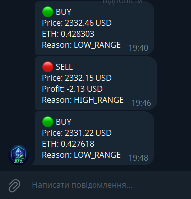

# Crypto Price Alert Bot

Python bot for monitoring Ethereum (ETH) price and sending Telegram alerts.

## Features

- Real-time ETH price tracking
- CoinGecko API integration
- Telegram notifications
- Buy/Sell signal simulation
- CSV logging
- Trade history tracking

## Technologies

- Python
- requests
- Telegram Bot API
- CoinGecko API
- CSV

## Run

```bash
pip install -r requirements.txt
python bot_eth.py

## Screenshot



## How It Works

- Retrieves ETH price data from CoinGecko API
- Monitors price changes in real time
- Simulates BUY/SELL signals
- Sends alerts to Telegram
- Logs trading history into CSV files